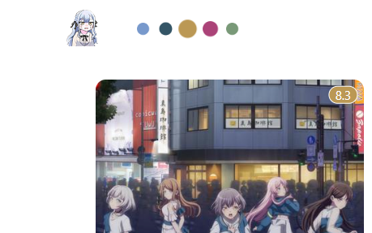
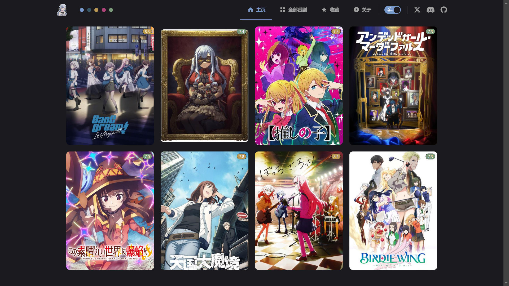
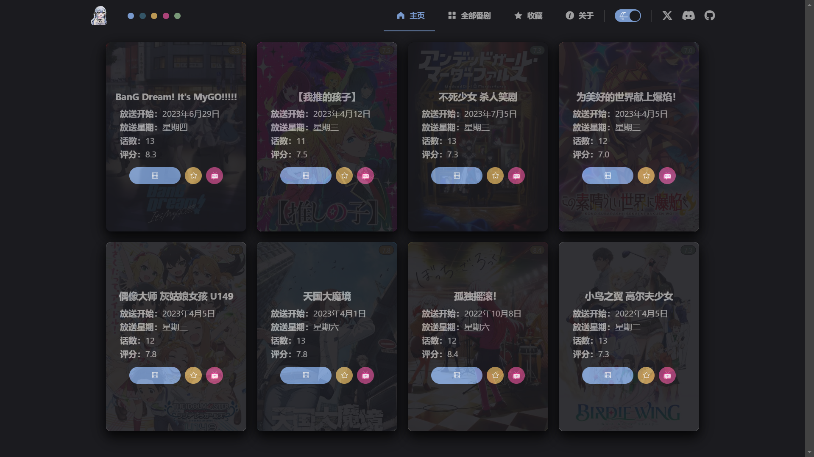

项目名 bangumi-list-vue3

TypeScript + Vue3 + Element-Plus
https://element-plus.org/zh-CN/component/overview.html

项目地址 https://github.com/haruki1953/bangumi-list-vue3

参考
[04_前端开发记录](../240215-e5-website-dev-diary/04_前端开发记录.md)
[06_移动端前端开发](../240215-e5-website-dev-diary/06_移动端前端开发.md)
[02-项目起步、Layout、Home](../240207vueNote/vue3小兔鲜/02-项目起步、Layout、Home.md)

# 一、初始化项目
## 1.1 pnpm 创建项目
创建项目：pnpm create vue  

- 安装依赖：pnpm install
- 运行项目：pnpm dev

## 1.2 ESLint & prettier 配置代码风格
**配置文件 .eslintrc.cjs**  
```js
/* eslint-env node */
require('@rushstack/eslint-patch/modern-module-resolution')

module.exports = {
  root: true,
  'extends': [
    'plugin:vue/vue3-essential',
    'eslint:recommended',
    '@vue/eslint-config-typescript',
    '@vue/eslint-config-prettier/skip-formatting'
  ],
  parserOptions: {
    ecmaVersion: 'latest'
  },
  rules: {
    'prettier/prettier': [
      'warn',
      {
        singleQuote: true, // 单引号
        semi: false, // 无分号
        printWidth: 80, // 每行宽度至多80字符
        trailingComma: 'none', // 不加对象|数组最后逗号
        endOfLine: 'auto' // 换行符号不限制（win mac 不一致）
      }
    ],
    'vue/multi-word-component-names': [
      'warn',
      {
        ignores: ['index'] // vue组件名称多单词组成（忽略index.vue）
      }
    ],
    'vue/no-setup-props-destructure': ['off'], // 关闭 props 解构的校验
    // 未定义变量错误提示
    'no-undef': 'error'
  }
}
```

```json
// ESlint插件 + Vscode配置 实现自动格式化修复
"editor.codeActionsOnSave": {
    "source.fixAll": true
},
"editor.formatOnSave": false,
```

## 1.3 基于 husky 的代码检查工作流
git初始化 git init（创建版本库）

初始化 husky 工具配置  https://typicode.github.io/husky/
```sh
pnpm dlx husky-init && pnpm install
```

暂存区 eslint 校验 **lint-staged 配置**  
1. 安装
```jsx
pnpm i lint-staged -D
```
2. 配置 `package.json`
```jsx
{
  // ... 省略 ...
  "scripts": {
    // ... 省略 ...
    "lint-staged": "lint-staged"
  }
  "lint-staged": {
    "*.{js,ts,vue}": [
      "eslint --fix"
    ]
  }
}
```
3. 修改 .husky/pre-commit 文件
```sh
# npm test 删掉
pnpm lint-staged
```

## 1.4 调整项目目录
### 删除文件
- 删除 src/assets 下的文件（存放图片等资源）
- 删除 src/components 下的文件（全局组件）
- 删除 src/stores 下的文件（状态管理）
- 删除 src/views 下的文件（视图页面）

> 参考了 base.css 尝试 [暗黑模式、自定义主题](笔记/暗黑模式、自定义主题.md)

### 修改内容
#### 路由采用hash模式
`src/router/index.ts` 初始化空路由
```jsx
import { createRouter, createWebHashHistory } from 'vue-router'

const router = createRouter({
  history: createWebHashHistory(import.meta.env.BASE_URL),
  routes: []
})

export default router
```
import.meta.env.BASE_URL 是路由的基准地址，默认是 '/'
vite.config.ts 添加配置 base: '/' 即可修改
```ts
// https://vitejs.dev/config/
export default defineConfig({
  plugins: [vue()],
  base: '/',
  resolve: {
    alias: {
      '@': fileURLToPath(new URL('./src', import.meta.url))
    }
  }
})
```

`src/App.vue`
```jsx
<script setup lang="ts"></script>

<template>
  <div>
    <!-- <router-view></router-view> -->
    我是app
  </div>
</template>

<style scoped></style>
```
`src/main.ts`
```jsx
import { createApp } from 'vue'
import { createPinia } from 'pinia'

import App from './App.vue'
import router from './router'

const app = createApp(App)

app.use(createPinia())
app.use(router)
app.mount('#app')
```

### 新增目录
src/
- apis （接口）
- composables （组合函数）
- config （配置信息）
- directives （全局指令）
- styles （全局样式）
- types （类型）
- utils （工具）

### 全局样式 资源 sass依赖
将项目需要图片文件 全局样式，复制到 src/assets src/styles  文件夹中, 
将全局样式在main.js中引入
```jsx
import '@/styles/main.scss'
```
安装 sass 依赖
```jsx
pnpm add sass -D
```

## 1.5 引入 Element Plus 组件库
**官方文档：** https://element-plus.org/zh-CN/
- 安装
```sh
$ pnpm add element-plus
```

**自动按需：**
1. 安装插件
```sh
pnpm add -D unplugin-vue-components unplugin-auto-import
```

2. 然后把下列代码插入到你的 `Vite` 或 `Webpack` 的配置文件中 vite.config.js
```jsx
...
import AutoImport from 'unplugin-auto-import/vite'
import Components from 'unplugin-vue-components/vite'
import { ElementPlusResolver } from 'unplugin-vue-components/resolvers'

// https://vitejs.dev/config/
export default defineConfig({
  plugins: [
    ...
    AutoImport({
      resolvers: [ElementPlusResolver()]
    }),
    Components({
      resolvers: [ElementPlusResolver()]
    })
  ]
})
```

**图标**
```
pnpm install @element-plus/icons-vue
```

### 解决自动引入造成的变量类型未声明问题
#### 在 eslintrc.cjs 中声明全局变量名
```js
// eslintrc.cjs
module.exports = {
  ...
  globals: {
    ElMessage: 'readonly',
  }
}
```
#### 在 tsconfig.app.json 中添加自动引入生成的类型声明文件
项目根目录下的 auto-imports.d.ts 与 components.d.ts 都是自动引入插件所生成的，其中包含了所使用的组件的类型信息。
> 好像要在网页预览之后，插件才会自动生成对应的类型导入

手动将这两个类型声明文件，添加至 tsconfig.app.json 中的 include 数组内
```json
{
  // ...
  "include": [
    // ...
    "auto-imports.d.ts",
    "components.d.ts"
  ],
}
```


## 1.6 Element Plus 自定义主题
用css变量不行，因为每个颜色有好几个亮度，还是要用scss
styles/element/index.scss
```scss
@forward 'element-plus/theme-chalk/src/common/var.scss' with (  
  $colors: (  
    'primary': (  
      // 主色 小祥 #7899CC
      'base': #7899CC,  
    ),  
    'success': (  
      // 成功色 小睦 #799978
      'base': #799978,  
    ),  
    'info': (  
      // 信息色 海玲 #345566
      'base': #345566,  
    ),  
    'warning': (  
      // 警告色 初华 #BB9854
      'base': #BB9854,  
    ),  
    'danger': (  
      // 危险色 喵梦 #AB4378
      'base': #AB4378,  
    ),  
    'error': (  
      // 错误色 喵梦 #AB4378
      'base': #AB4378,  
    ),  
  )  
)
```

### 配置自定义scss自动导入
> 这里自动导入需要深入到elementPlus的组件中，按照官方的配置文档来
> 1. 自动导入定制化样式文件进行样式覆盖
> 2. 按需定制主题配置 （需要安装 unplugin-element-plus）

vite.config.ts
```javascript
import { fileURLToPath, URL } from 'node:url'
import { defineConfig } from 'vite'
import vue from '@vitejs/plugin-vue'
import AutoImport from 'unplugin-auto-import/vite'
import Components from 'unplugin-vue-components/vite'
import { ElementPlusResolver } from 'unplugin-vue-components/resolvers'

// https://vitejs.dev/config/
export default defineConfig({
  plugins: [
    vue(),
    AutoImport({
      resolvers: [ElementPlusResolver()],
    }),
    // 1. 配置elementPlus采用sass样式配色系统
    Components({
      resolvers: [ElementPlusResolver({ importStyle: 'sass' })],
    }),
  ],
  resolve: {
    alias: {
      '@': fileURLToPath(new URL('./src', import.meta.url))
    }
  },
  css: {
    preprocessorOptions: {
      scss: {
        // 2. 自动导入定制化样式文件进行样式覆盖
        additionalData: `
          @use "@/styles/element/index.scss" as *;
        `,
      }
    }
  }
})
```


### 有点问题，解决：CSS、SCSS双管齐下
当在页面中使用 ElMessage 时，自定义样式失效了，可能时ElMessage的自动导入导致的
又试了试官网说的另一种导入方法 unplugin-element-plus，也还是不行。

现在的解决办法是，先用原先的方法（SCSS）使自定义样式生效，在开发者工具中复制如下css变量，粘贴至main.scss 

```scss
:root:root {
	--el-color-primary: #7899CC;
    --el-color-primary-light-3: #a1b8db;
    --el-color-primary-light-5: #bccce6;
    // ...
}
```
只用:root不生效 :root:root 我也忘了在哪看的


## 1.7 Pinia
安装自动持久化插件
```sh
pnpm add pinia-plugin-persistedstate -D
```
stores/index.ts
```ts
import { createPinia } from 'pinia'
import persist from 'pinia-plugin-persistedstate'

const pinia = createPinia()
pinia.use(persist)

export default pinia
export * from './modules/bgmData'
```
stores/modules/bgmData.ts
```ts
import { defineStore } from 'pinia'
import { ref } from 'vue'

// 番剧数据模块
export const useUserStore = defineStore(
  'bangumi-bgmData',
  () => {
    const bgmList = ref([]) // 番剧数据

    return { bgmList }
  },
  {
    persist: true // 持久化
  }
)
```
main.ts
```ts
import '@/styles/main.scss'

import { createApp } from 'vue'
import App from './App.vue'
import router from './router'
import pinia from './stores'

const app = createApp(App)

app.use(pinia)
app.use(router)

app.mount('#app')
```

## 1.8 数据交互 - 请求工具设计
安装 axios
```
pnpm add axios
```
新建 `utils/http.ts` 封装 axios 模块
    利用 axios.create 创建一个自定义的 axios 来使用  
    http://www.axios-js.com/zh-cn/docs/#axios-create-config  
utils/http.ts
```ts
import axios from 'axios'
import { axiosConfig } from '@/config'

const instance = axios.create({
  // TODO 1. 基础地址，超时时间
  baseURL: axiosConfig.baseUrl,
  timeout: axiosConfig.timeout
})

// 请求拦截器
instance.interceptors.request.use(
  (config) => {
    // TODO 2. 携带token （此项目中不需要）
    // const useStore = useAuthStore()
    // if (useStore.token) {
    //   config.headers.Authorization = useStore.token
    // }
    return config
  },
  (err) => Promise.reject(err)
)

// 响应拦截器
instance.interceptors.response.use(
  (res) => {
    // （本项目不需要）
    // TODO 4. 摘取核心响应数据
    // 204 响应表示请求成功但无内容
    // if (res.status === 204 || res.data.code === 0) {
    //   return res
    // }
    // TODO 3. 处理业务失败
    // 处理业务失败, 给错误提示，抛出错误
    // ElMessage.error(res.data.message || '服务异常')
    // return Promise.reject(res.data)
    return res
  },
  (err) => {
    // TODO 5. 处理401错误（本项目不需要）
    // 错误的特殊情况 => 401 权限不足 或 token 过期 => 拦截到登录
    // if (err.response?.status === 401) {
    //   router.push('/login')
    // }

    // 错误的默认情况 => 只要给提示
    // ElMessage.error(err.response?.data.message || '服务异常')
    ElMessage.error('服务异常')
    return Promise.reject(err)
  }
)

export default instance
```

## 1.9 整体路由设计

|path|文件|功能|路由级别|
|---|---|---|---|
|/|views/layout/LayoutContainer.vue|布局架子|一级路由|
||views/home/HomePage.vue|首页|二级路由|
|/list|views/list/BangumiList.vue|全部番剧|二级路由|
|/about|views/about/AboutPage.vue|关于|二级路由|

不使用异步导入组件了

顺便实现
- 网站图标
- 标题切换
- 路由不存在，拦截到首页
- 路由加载标识

（一期）

# 二、layout页面布局

## 暗黑模式引起的自定义样式问题
[暗黑模式、自定义主题【暗黑模式引起的自定义样式问题（自行scss颜色混合）】](笔记/暗黑模式、自定义主题.md#暗黑模式引起的自定义样式问题（自行scss颜色混合）)

## 响应式边距
```
$ref-margin: 80px;
.container {
  margin-left: $ref-margin;
  margin-right: $ref-margin;
}
.shim {
  width: $ref-margin;
}
@media (max-width: 1200px) {
  .container {
    margin-left: 10px;
    margin-right: 10px;
  }
  .shim {
    display: none;
  }
}
```

## 菜单栏
### 在顶部时隐藏边框
VueUse useScroll
```
const { arrivedState } = useScroll(document)

<el-menu
    :default-active="$route.path"
    :class="{ 'menu-on-top': arrivedState.top }"
    mode="horizontal"
    :ellipsis="false"
    router


.menu-on-top {
  background-color: transparent;
  border-bottom-color: transparent;
}
```

### 滚动条常驻
解决切换菜单时的位移问题
```css
html{
    overflow-y: scroll;
}
```

### 暗黑模式开关
[暗黑模式、自定义主题](笔记/暗黑模式、自定义主题.md)

### 社交媒体图标
https://fontawesome.com/v5/search?o=r&m=free
```
<link rel="stylesheet" href="https://cdnjs.cloudflare.com/ajax/libs/font-awesome/5.15.4/css/all.min.css">
<link rel="stylesheet" href="https://cdnjs.cloudflare.com/ajax/libs/font-awesome/6.5.2/css/all.min.css">
```

### 圆点装饰

或许可以做加载动画

### 移动端响应式


# 三、数据请求与保存

data文件夹放在public下

## 数据结构设计
（编写types）
bgmList 番剧数据列表，每一项是番剧信息
id为字符串（懒得转了）
```ts
export interface BgmData {
  id: string
  alistPath: string
  bgmUrl: string
  img: string
  name: string
  chineseName: string
  episode: string
  date: string
  weekday: string
  score: string
}
```

bgmFiles 番剧文件信息列表，用于保存请求获取的文件信息
```ts
[
	{
		fileName: '文件名',
		lastModified: '最后修改时间',
		showOnHome: false, // 是否在首页显示
		bgmIds: ['111', '222'] // 所包含的番剧的id
	}
]

export interface BgmFile {
  fileName: string
  lastModified: string
  showOnHome: boolean
  bgmIds: string[]
}

export interface BgmConfig {
  bgmFileList: {
    fileName: string
    lastModified: string
    showOnHome: boolean
  }[]
}
```

## 接口
（编写apis）
如此标注类型即可
```ts
export const bangumiGetConfigService = () =>
  http.get<BgmConfig>('/config.json')

export const bangumiGetBgmDataService = (filename: string) =>
  http.get<BgmData[]>(`/${filename}`)
```

**每次启动要做的事**
获取config bgmFileList

从bgmFiles中去掉bgmFileList里没有的番剧文件

遍历bgmFileList，记录需要获取数据的文件名（不存在或已更改），对于不存在的需要在bgmFiles初始化占位数据
	// 注意 lastModified 之类的数据同步，应该请求全部完成后最后更改，和更新bgmIds一起
	// 同步 showOnHome
	// existsFile.showOnHome = item.showOnHome
	// 已更改，同步 lastModified
	// existsFile.lastModified = item.lastModified

将记录的文件名按bgmFileList中的时间排序

根据记录请求获取全部
```ts
// 根据 needGetFilenames 请求获取全部数据
const requests = needGetFilenames.map((filename) =>
	bangumiGetBgmFileService(filename)
)
const resList = await Promise.all(requests)
```

遍历获取的 resList 
	遍历番剧数据列表，添加入bgmList，存在则替换
	保存番剧id数组，更新bgmFiles信息

从 bgmFileList 同步所有数据

bgmList去除所有bgmIds都不包含的

完成


正在加载标识，控制装饰点动画


# 四、首页
先将基本的样式搭好

## 封装bgmCard

## 封面图片
懒加载
加载占位图片、失败图片

## 评分

## 弹出栏
绝对定位
通过透明度与位移来实现显示动画
pointer-events: none; // 允许点击穿透
pointer-events: visiblePainted; // 允许元素可见部分响应鼠标事件





