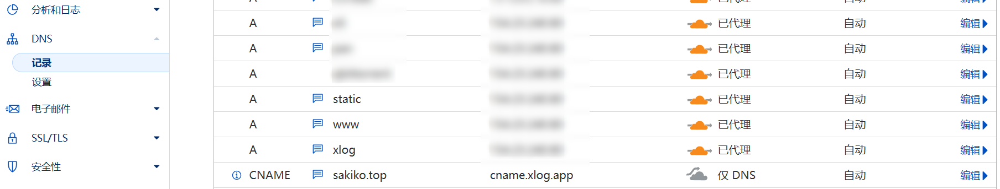

## 240710
- 番剧封面反向代理
- 前端可重写番剧数据中的相关链接（封面、alist链接）
- 关于页面添加可动态控制的内容
- TDK再改一下，加网页图片
- BgmConfig类型中、忘了给其中的一些属性设置为可选
- 解决“物语系列 外传季&amp;怪物季”特殊字符显示问题

### 番剧封面反向代理
因为bgm的图片有时候加载不出来，而且其浏览器缓存只有8天，所以现在反向代理一下 并将浏览器缓存加长为180天，在配置一下反向代理缓存30天

```
原
https://lain.bgm.tv/r/400/pic/cover/l/98/5e/386809_1yR81.jpg
代理后
https://static.sakiko.top/bangumi-cover/l/98/5e/386809_1yR81.jpg
```


```nginx
#PROXY-START/bangumi-cover/

location ^~ /bangumi-cover/
{
    proxy_pass https://lain.bgm.tv/r/400/pic/cover/;
    proxy_set_header Host lain.bgm.tv;
    proxy_set_header X-Real-IP $remote_addr;
    proxy_set_header X-Forwarded-For $proxy_add_x_forwarded_for;
    proxy_set_header REMOTE-HOST $remote_addr;
    proxy_set_header Upgrade $http_upgrade;
    proxy_set_header Connection $connection_upgrade;
    proxy_http_version 1.1;
    # proxy_hide_header Upgrade;

    add_header X-Cache $upstream_cache_status;
		#Set Nginx Cache


    if ( $uri ~* "\.(gif|png|jpg|css|js|woff|woff2)$" )
    {
        expires 1m;
    }
    proxy_ignore_headers Set-Cookie Cache-Control expires;
    proxy_cache cache_one;
    proxy_cache_key $host$uri$is_args$args;
    proxy_cache_valid 200 304 301 302 43200m;
}

#PROXY-END/bangumi-cover/
```

遇到了一点问题😇，问题不小
（地址栏对不上是因为后来又改代理目录了（可能是因为cf缓存导致了奇怪的问题，所以改了））


#### 问题描述【给 阿ni】

##### 1. 是使用宝塔面板配置的反向代理


在其中也可以看配置文件

```nginx
#PROXY-START/bangumi-cover/

location ^~ /bangumi-cover1/
{
    proxy_pass https://lain.bgm.tv/r/400/pic/cover/;
    proxy_set_header Host lain.bgm.tv;
    proxy_set_header X-Real-IP $remote_addr;
    proxy_set_header X-Forwarded-For $proxy_add_x_forwarded_for;
    proxy_set_header REMOTE-HOST $remote_addr;
    proxy_set_header Upgrade $http_upgrade;
    proxy_set_header Connection $connection_upgrade;
    proxy_http_version 1.1;
    # proxy_hide_header Upgrade;

    add_header X-Cache $upstream_cache_status;
		#Set Nginx Cache

    if ( $uri ~* "\.(gif|png|jpg|css|js|woff|woff2)$" )
    {
        expires 1m;
    }
    proxy_ignore_headers Set-Cookie Cache-Control expires;
    proxy_cache cache_one;
    proxy_cache_key $host$uri$is_args$args;
    proxy_cache_valid 200 304 301 302 43200m;
}

#PROXY-END/bangumi-cover/
```

上面是单独的反向代理的配置，会被网站的配置文件include


##### 2. 反向代理配置失败了
```
图片原本的链接是 
https://lain.bgm.tv/r/400/pic/cover/l/98/5e/386809_1yR81.jpg

经过反向代理后应该是 
https://static.sakiko.top/bangumi-cover1/l/98/5e/386809_1yR81.jpg

但是访问后就是上面的cf的502界面
```

这就是服务器上发生的事，至于为什么会显示 cloudflare 的报错，应该是因为用了cf的dns和代理


以下结合另一个被我反向代理的网站，还有一点猜测

```
这个是正常的
原本的链接为
https://cdn.jsdelivr.net/npm/@widgetbot/crate@3
反向代理后为
https://static.sakiko.top/cdn_jsdelivr_net/npm/@widgetbot/crate@3

如果将其故意修改为错的
https://static.sakiko.top/cdn_jsdelivr_net/npm/@widgetbot/crate@3aaaaaaa
就会出现cf502页面
```

有时候会是这个页面，但刷新几下就会变回cf的502页面

